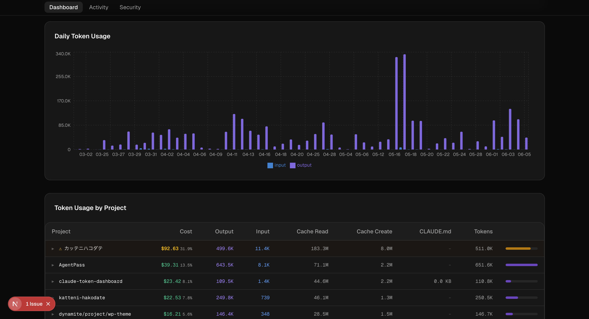
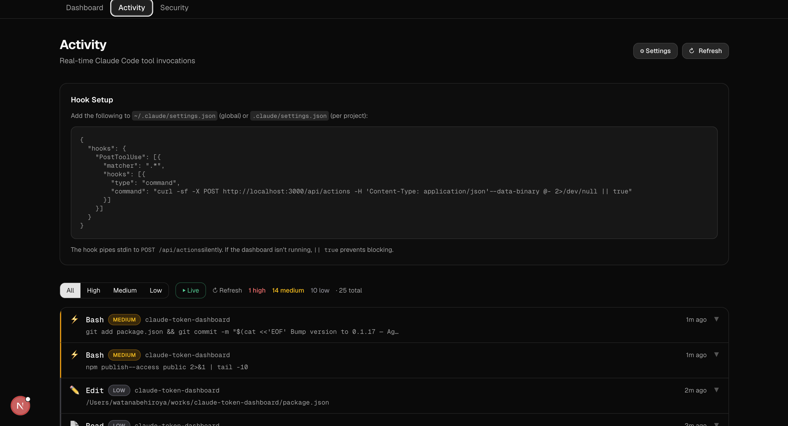
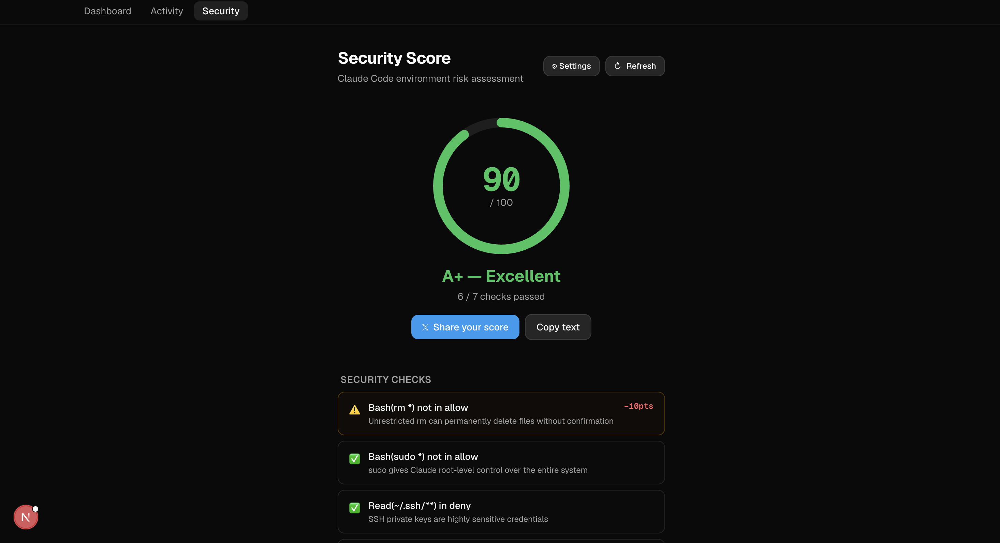
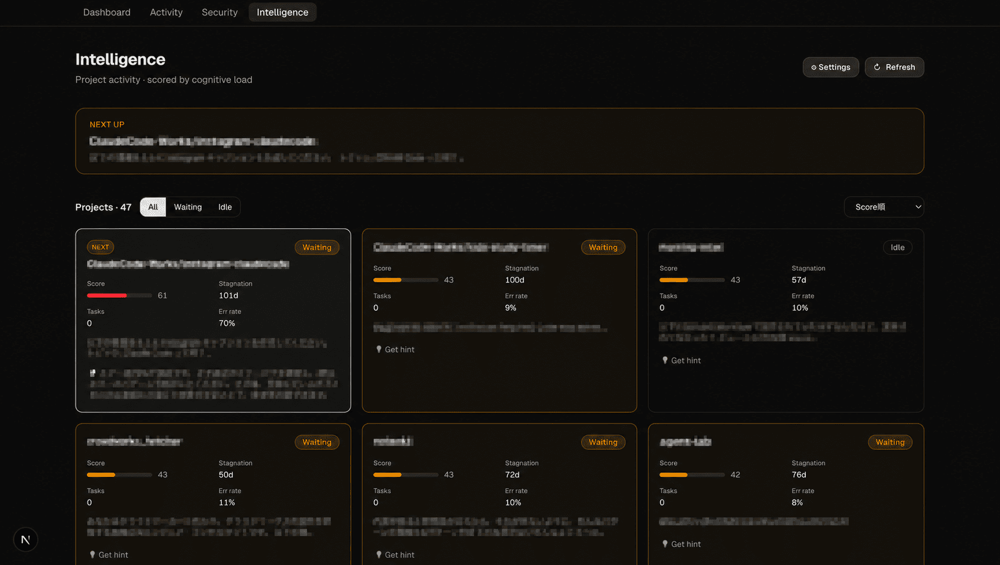
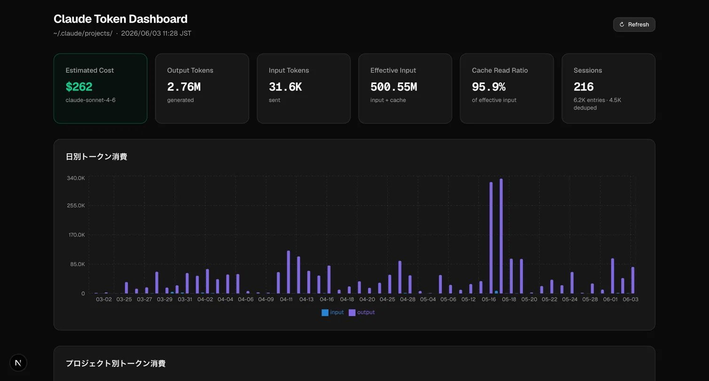
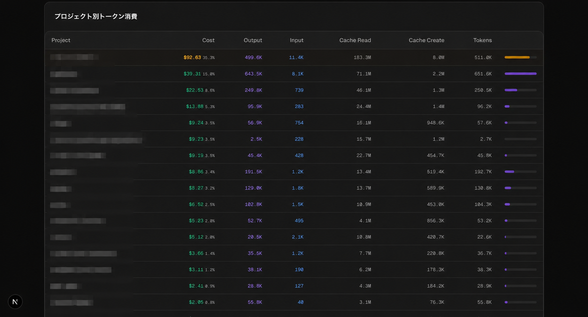

# Claude Token Dashboard

[](https://www.producthunt.com/posts/claude-token-dashboard)

<table>
  <tr>
    <td align="center"><br /><sub>Dashboard — token &amp; cost by project</sub></td>
    <td align="center"><br /><sub>Activity — real-time action log</sub></td>
    <td align="center"><br /><sub>Security — environment risk score</sub></td>
    <td align="center"><br /><sub>Intelligence — cognitive load scoring</sub></td>
  </tr>
</table>

> Visualize your [Claude Code](https://claude.ai/code) token usage by project and date — built with Next.js + Tailwind.





## Quick Start (No Install)

```bash
npm install -g @notenkidev/claude-token-dashboard
claude-token-dashboard
```

Open http://localhost:3000

## What it shows

| Section | Details |
|---|---|
| **Summary cards** | Estimated total cost · Output tokens · Input tokens · Effective input · Cache read ratio · Session count |
| **Daily chart** | Input / output tokens per day (bar chart) |
| **Project table** | Per-project breakdown sorted by cost, with inline bar |

Cache read tokens from prompt caching are tracked separately — you can see at a glance how much of your effective input Claude is serving from cache (typically 90%+).

## Features

- Token usage per project (output / input / cache read / cache create)
- Daily usage chart
- Cache read ratio
- Estimated cost in USD per project (claude-sonnet-4-6 pricing)
- Cost share % with warning for projects over 20% of total spend
- Total estimated cost since first session

## Quick start

```bash
npm install -g @notenkidev/claude-token-dashboard
claude-token-dashboard
```

Open [http://localhost:3000](http://localhost:3000).

**Custom port:**

```bash
claude-token-dashboard -p 4000
```

Reads `~/.claude/projects/**/*.jsonl` directly — no config, no API key needed.

## How it works

Claude Code writes every conversation turn to JSONL files under `~/.claude/projects/`. Each assistant message includes a `usage` object with `input_tokens`, `output_tokens`, `cache_creation_input_tokens`, and `cache_read_input_tokens`.

This app:
1. Scans all JSONL files at request time (server-side, no API key needed)
2. Deduplicates by `message.id` (the same message can appear in multiple entries)
3. Groups by project (`cwd` field) and by date (`timestamp` field)
4. Renders everything as a dark-mode dashboard

Hit **Refresh** to re-read the files without restarting the server.

## Activity Log (New in v0.1.16)

Claude Code hooks経由でリアルタイムに行動ログを取得する機能。

### セットアップ

`~/.claude/settings.json` に以下を追加：

```json
{
  "hooks": {
    "PostToolUse": [{
      "matcher": ".*",
      "hooks": [{
        "type": "command",
        "command": "curl -sf -X POST http://localhost:3000/api/actions -H 'Content-Type: application/json' --data-binary @- 2>/dev/null || true"
      }]
    }]
  }
}
```

### 取得できる情報

- File reads / edits / writes
- Bash commands（risk level付き）
- API calls

http://localhost:3000/activity で確認できます。

## Tech stack

- [Next.js 16](https://nextjs.org) — App Router, Server Components
- [Tailwind CSS](https://tailwindcss.com) — dark mode, utility-first
- [Recharts](https://recharts.org) — daily bar chart
- [shadcn/ui](https://ui.shadcn.com) — Card, Badge components

## Why I built this

I had no idea how many tokens I was burning per project in Claude Code. Turns out all the data is sitting in `~/.claude/projects/` as JSONL files — one file per session, one JSON line per turn. Parsing it took about 100 lines of Python to confirm, and a weekend to turn into something worth looking at.
