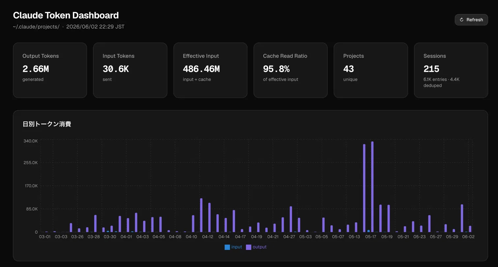
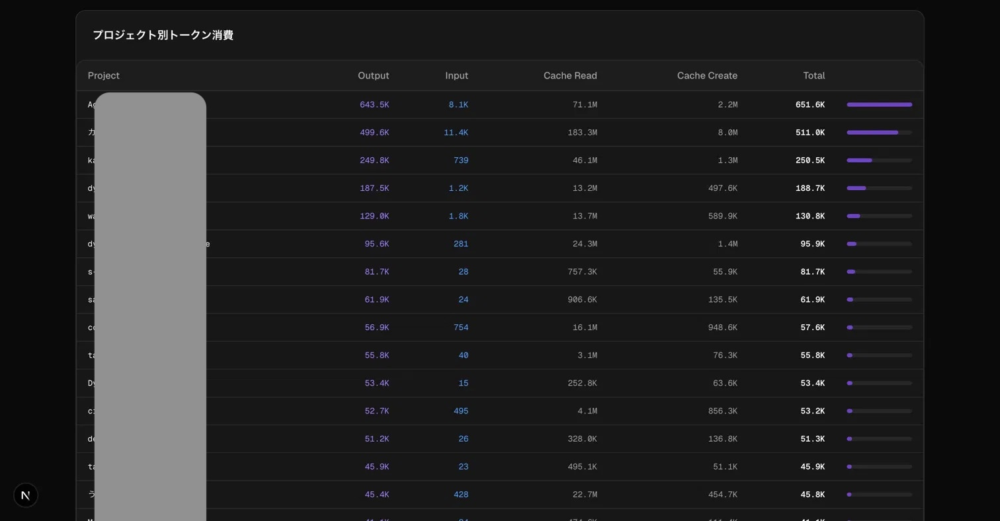

# Claude Token Dashboard

> Visualize your [Claude Code](https://claude.ai/code) token usage by project and date — built with Next.js + Tailwind.





## What it shows

| Section | Details |
|---|---|
| **Summary cards** | Output tokens · Input tokens · Effective input · Cache read ratio · Project count · Session count |
| **Daily chart** | Input / output tokens per day (bar chart) |
| **Project table** | Per-project breakdown sorted by total usage, with inline bar |

Cache read tokens from prompt caching are tracked separately — you can see at a glance how much of your effective input Claude is serving from cache (typically 90%+).

## Quick start

```bash
git clone https://github.com/notenkitoclient-cpu/claude-token-dashboard
cd claude-token-dashboard
npm install
npm run dev
```

Open [http://localhost:3000](http://localhost:3000).

Reads `~/.claude/projects/**/*.jsonl` directly — no configuration needed.

## How it works

Claude Code writes every conversation turn to JSONL files under `~/.claude/projects/`. Each assistant message includes a `usage` object with `input_tokens`, `output_tokens`, `cache_creation_input_tokens`, and `cache_read_input_tokens`.

This app:
1. Scans all JSONL files at request time (server-side, no API key needed)
2. Deduplicates by `message.id` (the same message can appear in multiple entries)
3. Groups by project (`cwd` field) and by date (`timestamp` field)
4. Renders everything as a dark-mode dashboard

Hit **Refresh** to re-read the files without restarting the server.

## Tech stack

- [Next.js 16](https://nextjs.org) — App Router, Server Components
- [Tailwind CSS](https://tailwindcss.com) — dark mode, utility-first
- [Recharts](https://recharts.org) — daily bar chart
- [shadcn/ui](https://ui.shadcn.com) — Card, Badge components

## Why I built this

I had no idea how many tokens I was burning per project in Claude Code. Turns out all the data is sitting in `~/.claude/projects/` as JSONL files — one file per session, one JSON line per turn. Parsing it took about 100 lines of Python to confirm, and a weekend to turn into something worth looking at.
